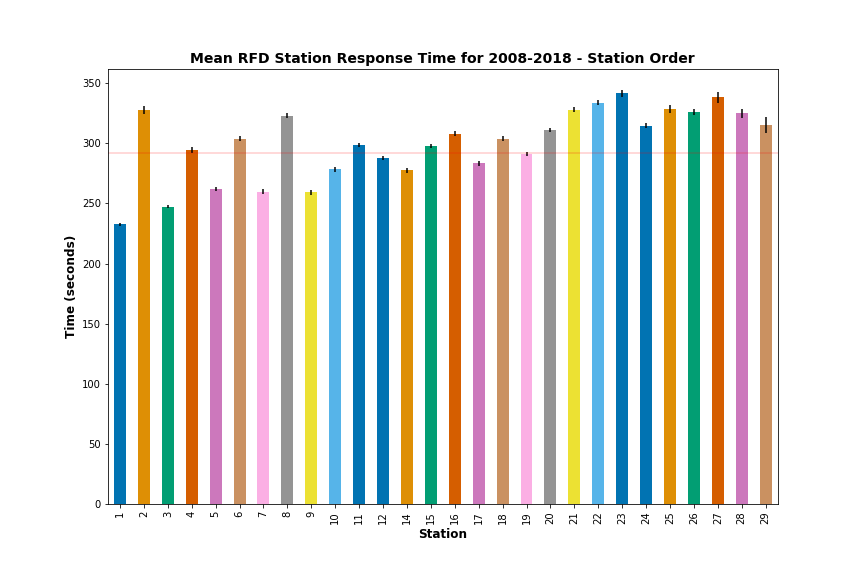
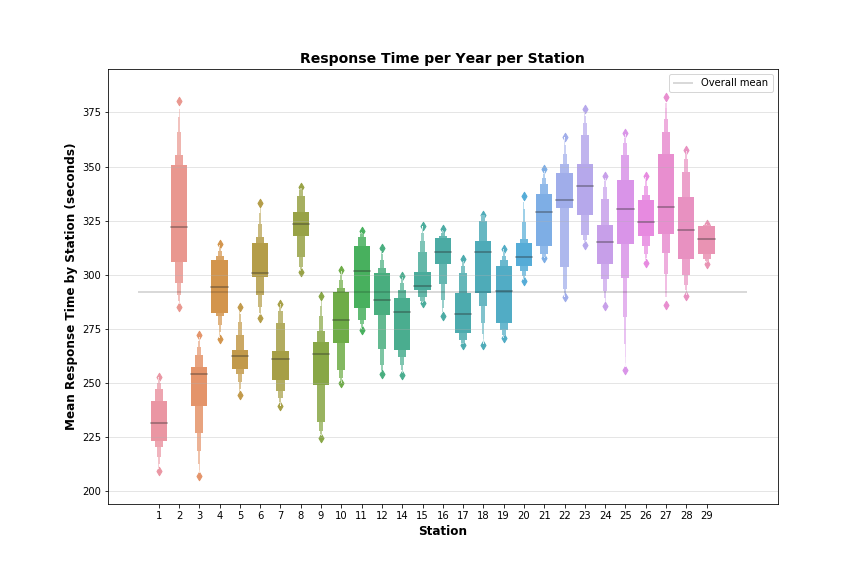
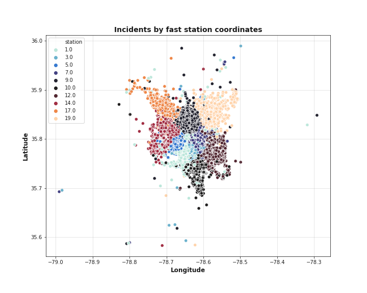
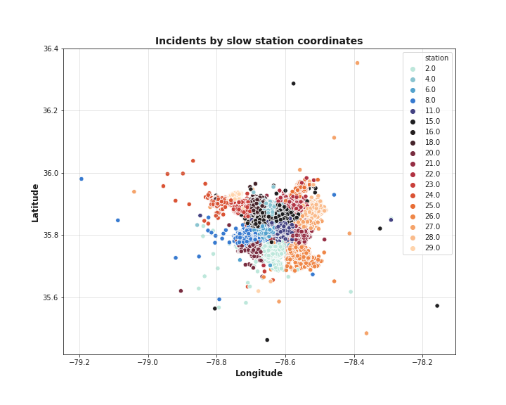
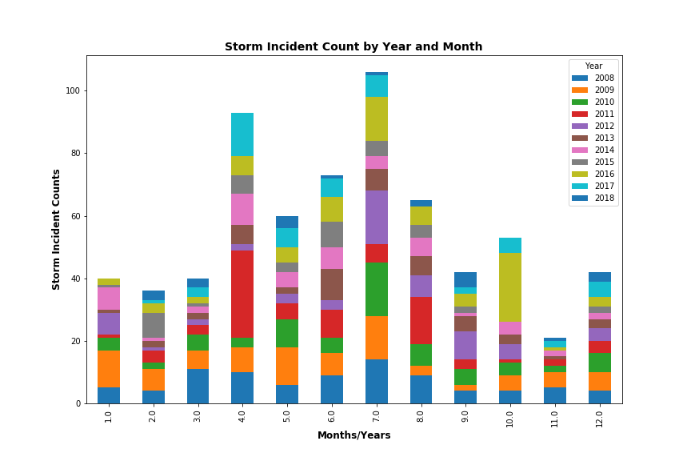

Raleigh Fire Incident Analysis
Data Analytics Bootcamp Project 1 - Team 7

By Jarod Hoffman, Virgil Inferido, Jill Cowan, Jennifer Turcotte, and Laura Weislo

January 16, 2019

## Introduction
Raleigh launched its open data project in 2012 when the City Council adopted the Open Source Resolution. Since then it has made available numerous datasets using the ArcGIS platform reflecting the functioning of a growing metropolitan center. We chose to focus on the fire incident data, which uses a nationally adopted system for coding emergency service calls into categories. It tracks dispatch and arrival times at incidents, type of incident, and location. The data allows us to view metrics in overall number of incidents over time, response speed by stations, and compare the number of incidents with population growth, weather, and more.

From the Raleigh Open Data website, we know there are 177,738 rows available. The API limits calls to 2000 records per request. We created a numpy array to make a list of start record number in increments of 2000, up to 176,000. We used that list to set the parameter for the starting record number in a loop, running 89 API calls to get all the incident and coordinate data.

Our try-except loop caught one call that repeatedly failed, but we were able to pull that set down from the web interface manually. We then parsed the two JSON files separately (one was a list, one was a single JSON set), created Pandas dataframes from the parsed data and appended the manually fetched set to the larger one.

There were 175738 records in the main set, but 1425 lacked coordinates, 1626 records lacked incident_type, 1436 were missing dispatch date/time and two did not have cleared date. The ‘missing’ set had 2000 records, 24 missing coordinates, 49 missing type. 

Once the two sets were merged, they were further cleaned by removing records from 2007, which had partial data, and 2019. After removing these records, we used a total of 158423 for further analysis.

For data analysis, we had to reformat the POSIX date time columns to datetime objects using the Pandas to_datetime function. This was tricky because we also had to take into consideration the times were UTC and needed to convert to EST time zone. We used dispatch datetime to create Year and YYYY-MM-DD dates for merging with population data and weather data, respectively.

## Fire incident analysis:

  - Added a column (timedelta) ‘Seconds’ that was arrive time minus dispatch time to track overall and individual station performance. 
  - Removed rows with null stations.
  - Grouped this dataset by Year, counted the IDs to get tally of incidents per year.
  - Calculated the mean, median standard deviation of response times. 

Raleigh FD data does not include EMS (due to HIPPA), which comprise 70% of the incidents total. What we examined was the remaining 30%.

The most common types of non-EMS incidents are false alarms, service calls and good intent calls, accounting for nearly 80% of the remaining incidents. Fires and hazardous conditions are the top incidents, accounting for about 10% of the non-EMS calls.

Raleigh FD had a mean incident rate of 14402.09 per year, median 13893.0, with a standard deviation of 1424.08 and error 429.38
The most incidents came in 2017 when there were 18051, the minimum in 2009 when there were 13026.
Fire incidents have generally been on the rise in Raleigh over the period of study

When we look just at 2017, there seemed to be an uptick in incidents in January and April

When grouped by month of the year, there is no discernable trend.

Incidents tend to peak during waking hours, especially late afternoon.

## Station response time analysis:

A list of stations was obtained from the Wake County website.
There was one record with station number 13, which does not exist.
There were 30034 rows without arrival times, so for the purposes of this analysis those were removed as arrival time was used to calculate the response from dispatch time.

These nulls fell into the following categories:
  -Dispatched & cancelled en route
  -False alarm or false call Other
  -Cover assignment standby moveup
  -Alarm system sounded due to malfunction
  -Service Call other

Of the remaining 128714 records, there were 58 incidents with response times more than 3 standard deviations from the mean. 
Before removing them, the RFD stations had a 306 second response time, with standard deviation 1049.
After removing outliers, the RFD stations had a 292.07 second response time, with standard deviation 143.35.

The station with the fastest response times averaged 232.54 seconds while the slowest averaged 341.4.
There were 18 stations with response times above average: 2, 4, 6, 8, 11, 15, 16, 18, 20, 21, 22, 23, 24, 25, 26, 27, 28, 29.

After interviewing Raleigh FD Planning Officer Andrew Langan, I discovered that some of the slow stations were specialized to Hazmat incidents which require more preparation. The higher numbered stations are in locations of urban sprawl and congestion, and this impacts their ability to respond quickly. The department should be hitting target response times 90% of the time, but they are currently only hitting target 80% of the time. This is reflected in the skew of the mean response times.

In looking further into the slow vs. fast stations, #1 in downtown Raleigh comprises two units, one of which will be split out to a new station 30 (13) in the near future. It is consistently the quickest. Slower stations tend to be more spread out in their calls.

## Fires and Storms

We attempted to link weather data to the incident dataset by calling the World Weather Online API, but this particular API was very hard to work with and appeared to be missing data for many days in the period of study. We merged several years worth of weather data and plotted the temperature, humidity, wind and precipitation against number of incidents and saw no correlation.

However, looking at just the fire codes (100's) and severe weather/disaster codes (800s) we were able to see increased numbers of fire incidents in April 2017 (possibly relating to the huge Metropolitan fire in downtown Raleigh, and storm-related increases relating to the periods around Hurricanes Irene, Matthew, and Florence, and snowstorms and tornado outbreaks.

Fire incidents were mapped by zip code and charted by animated gif over the years studied. It appeared that the downtown zip code 27601 consistently had the highest number of incidents.

## National Statistics

The FEMA US Fire Administration National Fire Data Center discloses overall statistics on their federal webpage. Access to the specific data is limited to state program managers and fire departments or through request for CD/DVD. So, we took the various data presented on the federal webpage and compiled into spreadsheets that were uploaded into jupyter notebook. 

Please note that EMS comprises about 70% of incidents however that data is protected under HIPPA and will not be included in the scope of this project.

We used the National Fire Incident Reporting System (NFIRS), the reporting standard that fire departments use to uniformly report on the full range of their activities, to bin incidents and create comprable graphs to evaluate how Raleigh Fire Department compares to national statistics. At the national level, Good Intent Calls were roughly 32% followed by False Alarms with 23%. However, NC had 36% False Alarms followed by Good Intent with 31%. So False Alarms in NC were significantly higher. 
